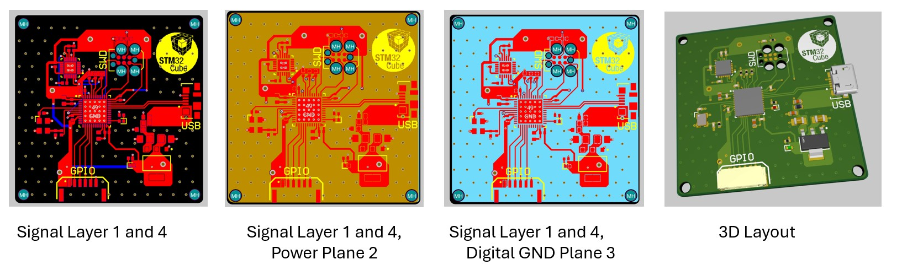

# STM32F411 Custom PCB

Custom PCB featuring STM32F411, GPIO access, onboard IMU, and USB interface.

## Features

- STM32F411 microcontroller
- GPIO access
- Onboard IMU for motion sensing
- USB connectivity
- Proper pin mapping & crystal configuration

## Hardware Overview

- **Microcontroller:** STM32F411
- **IMU:** MPU-6050
- **USB:** Micro-USB
- **Crystal:** 24 MHz

## PCB Layouts

